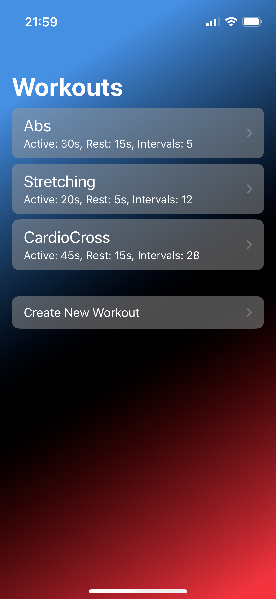
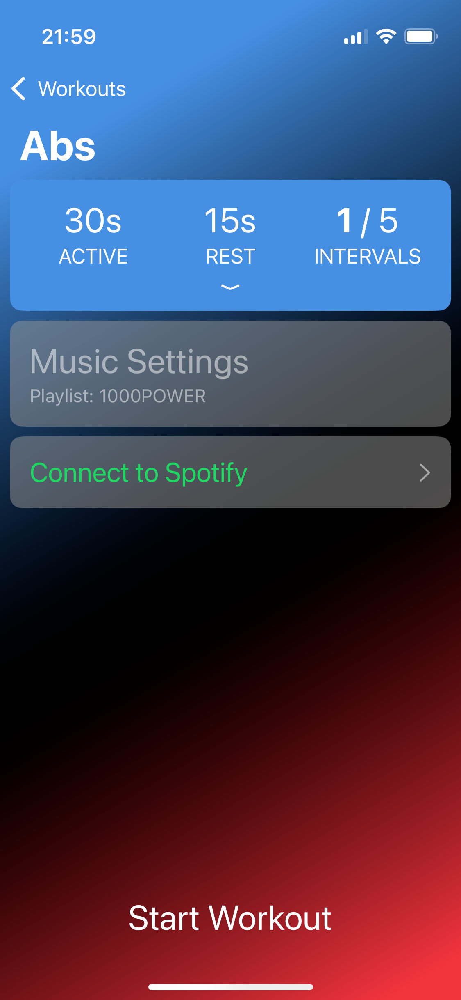
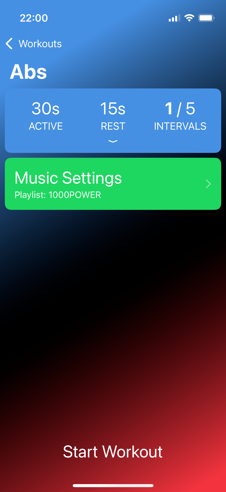
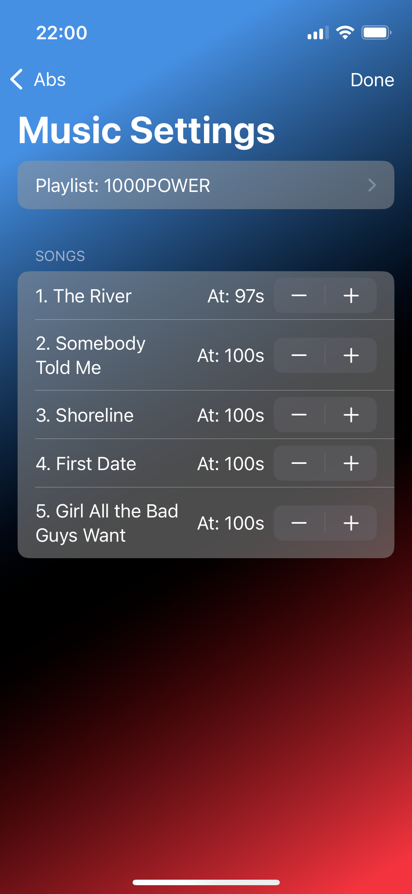
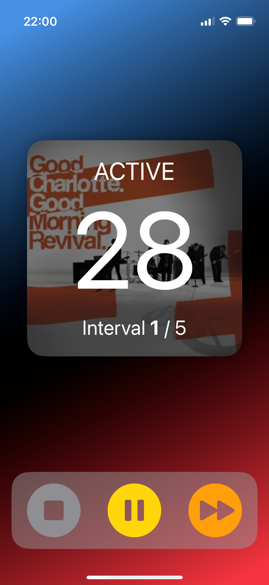

# Cardio Intervals

Cardio Intervals is an iPhone app designed to help you manage interval workouts. It tracks active and rest phases, providing visual cues to guide your training sessions. The app integrates with Spotify to play music during the active phases, so you can stay focused without switching between apps.

- Set custom active and rest intervals.
- Visual countdown timer.
- Spotify integration to play music.
- Custom start time for each song. Skip that boring intro and get right into the chorus!

## Screenshots

